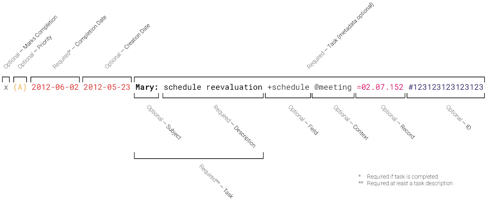

# `ubs.todo` format
[](https://github.com/Nereare/ubs.todo/releases)
[](LICENSE.md)

A fork of `todo.txt` aimed at primary care (_ESF_) task listing.

The first and most important rule of `ubs.todo`:

    A single line in your todo.txt text file represents a single task.

## Why plain text?

Plain text is software and operating system agnostic. It's searchable, portable, lightweight, and easily manipulated. It's unstructured. It works when someone else's web server is down or your Outlook `.PST` file is corrupt. There's no exporting and importing, no databases or tags or flags or stars or prioritizing or _insert-company-name-here_-induced rules on what you can and can't do with it.

## The 3 axes of `ubs.todo`

Using special notation in `ubs.todo`, you can create a list that's sliceable by 3 key axes:

### 1. Priority

Your todo list should be able to tell you what's the next most important thing for you to get done - either by project, by context, or overall. You can optionally assign tasks a priority that'll bubble them up to the top of the list.

### 2. Subject & Task

Each task of a primary care professional usually regards a person - this is the subject. The subject is the object or the focus of a task which regards it.

### 3. Metadata

Each task can have some metadata regarding it, such as fields, contexts or subject informations.

## `ubs.todo` format rules



Your `ubs.todo` is a plain text file. To take advantage of structured task metadata like priority, fields, contexts, creation, and completion dates, there are a few simple but flexible file format rules.

Philosophically, the `ubs.todo` file format has two goals:

- The file contents should be human-readable without requiring any tools other than a plain text viewer or editor.
- A user can manipulate the file contents in a plain text editor in a sensible, expected way. For example, a text editor that can sort lines alphabetically should be able to sort your task list in a meaningful way.

These two goals are why, for example, lines start with priority and/or dates so that they are easily sorted by priority or time, and completed items are marked with an `x`, which both sorts at the bottom of an alphabetical list and looks like a filled-in checkbox.

Here are the rest:

## Incomplete Tasks: 4 Format Rules

The beauty of `ubs.todo` is that it's completely unstructured; the metadata you can attach to each task are only limited by your imagination. To get started, use special notation to indicate task context (_e.g._ `@meeting` ), fields (_e.g._ `+mentalHealth` ) and priority (_e.g._ `(A)` ).

A `ubs.todo` file might look like the following:

```
(A) Mary: schedule return @meeting
(B) John: check labs +sexHealth @adm
Women Group: confirm participants @meeting
Print flyers +sexHealth
```

A search and filter for the `@meeting` contextual items would output:

```
(A) Mary: schedule return @meeting
Women Group: confirm participants @meeting
```

To just see the `+sexHealth` field items would output:

```
(B) John: check labs +sexHealth @adm
Print flyers +sexHealth
```

There are four formatting rules for current todo's.

### Rule 1: If priority exists, it ALWAYS appears first.

The priority is an uppercase character from A-Z enclosed in parentheses and followed by a space.

This task has a priority:

```
(A) Mary: schedule return @meeting
```

These tasks do not have any priorities:

```
Women Group: confirm participants @meeting
(b) Confirm vacation
(B)->Submit notification
```

### Rule 2: A task's creation date may optionally appear directly after priority and a space.

If there is no priority, the creation date appears first. If the creation date exists, it should be in [the format][ISO 8601] `YYYY-MM-DD`.

These tasks have creation dates:

```
2011-03-02 Document evolution +evol
(A) 2011-05-13 Betany: calculate scores
```

This task doesn't have a creation date:

```
(A) Bring snacks 2011-03-02
```

### Rule 3: Fields, Contexts, Prontuaries and IDs must appear in the line AFTER priority, dates and subject/task.

- A *field* is preceded by a single space and an plus-sign (`+`).
- A *context* is preceded by a single space and a at-sign (`@`).
- A *record* is preceded by a single space and an equal-sign (`=`).
- An *ID* is preceded by a single space and a hashtag (`#`).
- A *field*, *context*, *record* or *ID* may contain any non-whitespace characters.
  - We recommend that *ID*'s be number-only.
  - We recommend that all metadata follow [lower camel case][camelCase] (a.k.a. dromedary case).
- A *task* may have zero, one, or more than one *fields*, *contexts*, *record* and/or *ID* included in it.

For example, this task is part of the `+mentalHealth` and `+schedule` fields as well as the `@meeting` context and the `=02.07.152` record:

```
(A) Jane: schedule reevaluation +mentalHealth +schedule @meeting =02.07.152
```

This task has no contexts in it:

```
Email manager at manager@example.com
```

This task has no fields in it:

```
Learn how to add 2+2
```

### Rule 4: Subject, when present, must be followed by a comma and a single space.

The task may have a subject (also usable as a title), which must be any number of words followed by a comma and a single space, with the taks after the single space.

The subject is optional, but, when set, a task must follow. If no subject is set, the task is also optional.

These are valid tasks:

```
(A) Jane: check labs @self
(B) Mark: archive record
(B) Fetch new materials +materials
```

These subjects are not valid:

```
(A) Mark: +labs
(C) Lucy:study lesion
```

## Complete Tasks: 2 Format Rules

Two things indicate that a task has been completed.

### Rule 1: A completed task starts with an lowercase x character (`x`).

If a task starts with an `x` (case-sensitive and lowercase) followed directly by a space, it is marked as complete.

This is a complete task:

```
x 2011-03-03 Email manager
```

These are **not** complete tasks.

```
xylophone lesson
X 2012-01-01 Study nem consensus
(A) x Find new prescriptions
```

We use a lowercase x so that completed tasks sort to the bottom of the task list using standard sort tools.

### Rule 2: The date of completion appears directly after the x, separated by a space.

For example:

```
x 2011-03-02 2011-03-01 Schedule meeting +schedule @self
```

If you’ve prepended the creation date to your task, on completion it will appear directly after the completion date. This is so your completed tasks sort by date using standard sort tools.

With the completed date (required), if you've used the prepended date (optional), you can calculate how many days it took to complete a task.

## Additional File Format Definitions

Tool developers may define additional formatting rules for extra metadata.

Developers should use the format `key:value` to define additional metadata (_e.g._ `due:2010-01-02` as a due date).

Both `key` and `value` must consist of non-whitespace characters, which are not colons. Only one colon separates the `key` and `value`.

### RegEx Validation

The followind regex rule (for JavaScript) can validate each line of a file. Analyzing each group can also show metadata, completion and subject.

```regex
/^(x )?(\([A-Z]\) )?( \d{4}\-\d{2}\-\d{2})?( \d{4}\-\d{2}\-\d{2})?((([^\+\@\=\#\:]+)\: )?[^\+\@\=\#\:\n]+)( [\+\@\=\#]([^\s]+))*$/gm
```

[camelCase]: https://en.wikipedia.org/wiki/Camel_case
[ISO 8601]: https://xkcd.com/1179/
